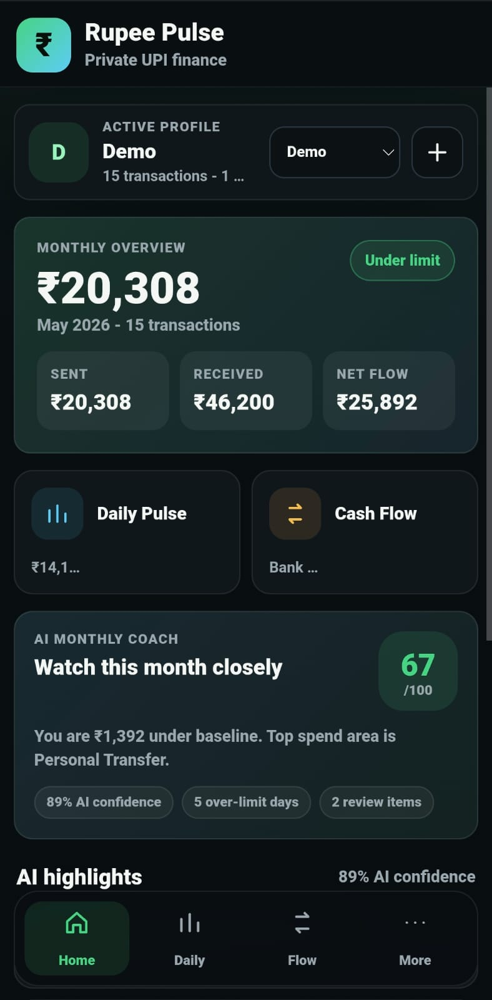
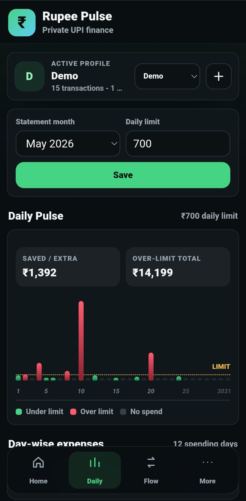
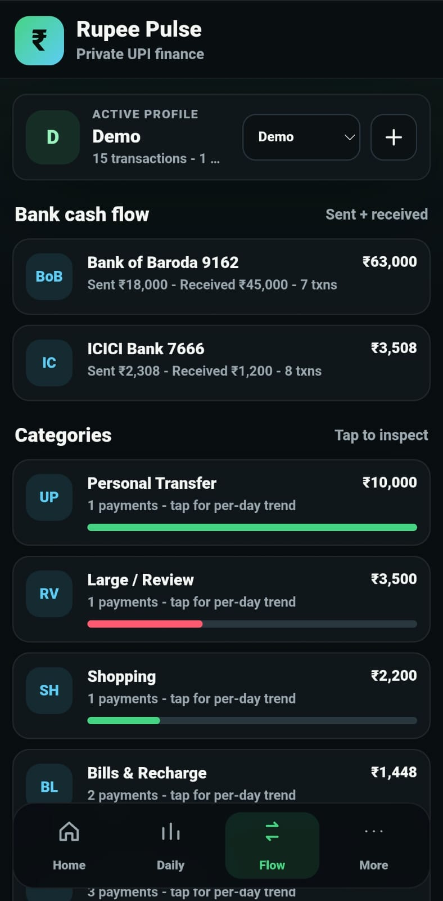
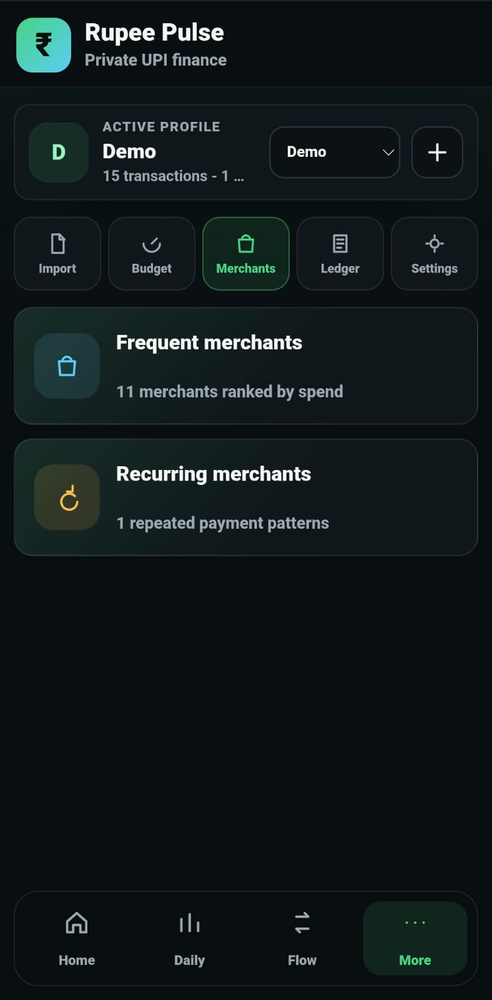
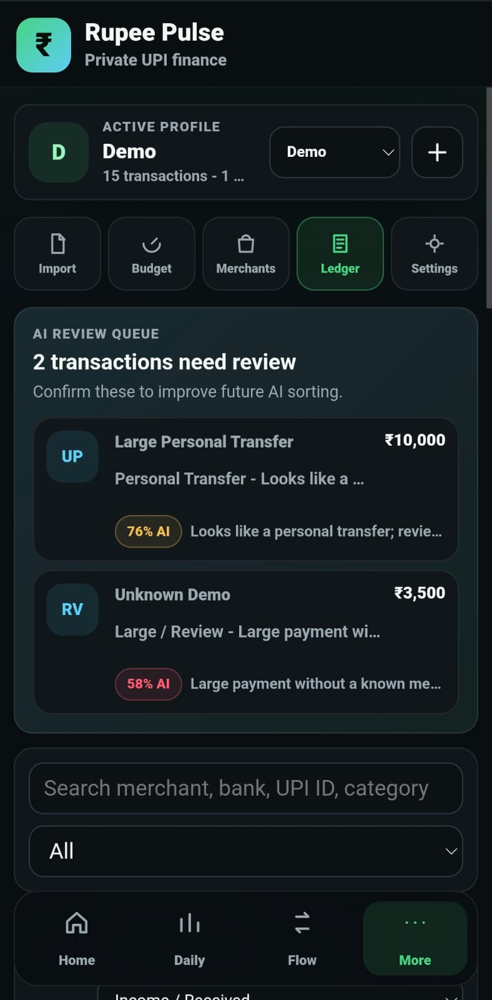

# Rupee Pulse

Private AI finance tracker for Google Pay statements.

Rupee Pulse converts monthly Google Pay PDF statements into a clean personal finance dashboard with daily spending insights, AI category reasoning, merchant tracking, bank-wise cash flow, review queues, and optional encrypted local storage.

## Live Demo

- App: https://rupeepulse-ai.netlify.app/
- Demo video: https://youtu.be/IpWjlxxtojs
- Demo statement: https://github.com/Pratham-8394/rupee-pulse-ai-finance-tracker/blob/main/rupee-pulse-demo-gpay-statement.pdf
## Screenshots

### Home Dashboard

### Daily Dashboard

### Flow Dashboard

### Merchants Dashboard

### Ledger Dashboard

### Settings Dashboard

## Problem

UPI users make many payments every month, but Google Pay statements are hard to understand as personal finance data. A PDF statement can show transactions, but it does not clearly answer:

- Which days crossed my spending limit?
- Which merchants do I pay most often?
- Which bank account is used the most?
- Which categories are taking most of my money?
- Which expenses need review?
- Did I save money or overspend this month?

Most users either ignore this data or manually maintain spreadsheets. Rupee Pulse turns the statement into useful financial insights without requiring bank login or manual entry.

## Solution

Rupee Pulse reads Google Pay PDF statements locally on the device and creates a private finance dashboard. Users can import monthly statements, set a daily limit, inspect daily spending, track merchant patterns, review categories, and protect saved data with an encrypted vault.

## Target Users

- UPI-heavy users in India
- Students and young professionals
- Salaried users tracking monthly expenses
- Families who want separate finance profiles
- Privacy-conscious users who do not want to link bank accounts
- Anyone who wants expense insights without using Excel

## AI Features

Rupee Pulse uses AI-style financial intelligence to make statement data easier to understand:

- Merchant normalization, such as grouping `PMPML`, `pmpml.org`, and `Pune Mahanagar Parivahan Sewa`.
- Automatic category detection from transaction text.
- AI confidence score for each categorized transaction.
- AI reasoning that explains why a transaction was placed in a category.
- Review queue for low-confidence, unknown, or large payments.
- Monthly AI coach score based on spend behavior, over-limit days, review items, and category confidence.
- Learning from user corrections in the ledger, so future transactions from the same merchant are categorized better.

## Core Features

- Google Pay PDF statement import
- Multiple user profiles
- Daily spending pulse with daily limit line
- Red alert days when spending crosses the limit
- Monthly saved or overspent calculation
- Bank-wise cash flow
- Category-wise spending analysis
- Frequent merchants and recurring merchants
- Merchant detail screens with all sent and received transactions
- Searchable transaction ledger
- AI review queue
- Category correction memory
- Export and restore backup
- Optional encrypted vault with app passcode
- Installable mobile app experience
- Offline support after first load

## Privacy And Security

Rupee Pulse is local-first.

- No bank login is required.
- PDFs are read locally on the user's device.
- Transaction data is not uploaded by default.
- Data is stored using IndexedDB and localStorage.
- Users can enable an encrypted vault, which encrypts saved finance data with an app passcode before storing it on the device.

If cloud sync is added in the future, the recommended approach is end-to-end encryption: encrypt on the phone first, then upload only encrypted data.

## Tech Stack

- HTML
- CSS
- JavaScript
- Progressive Web App manifest
- Service worker for offline caching
- IndexedDB for durable local storage
- Web Crypto API for encrypted vault
- Local PDF text extraction logic

## How To Run Locally

This is a static web app.

1. Download or clone this repository.
2. Open `index.html` in a modern Chromium-based browser.
3. For the best mobile experience, deploy it on HTTPS using Netlify, Vercel, or GitHub Pages.
4. Open the hosted link on Android Chrome.
5. Tap `Install app` or `Add to Home screen`.

## Demo Instructions

Use the included demo PDF:

https://github.com/Pratham-8394/rupee-pulse-ai-finance-tracker/blob/main/rupee-pulse-demo-gpay-statement.pdf

Recommended demo flow:

1. Open the app.
2. Create or select a profile.
3. Go to `More > Import`.
4. Import the demo Google Pay statement PDF.
5. Show the Home dashboard and AI monthly coach.
6. Open Daily Pulse to show over-limit days.
7. Open Flow to show bank and category analysis.
8. Open Merchants to show frequent and recurring merchants.
9. Open Ledger to show AI confidence, AI reasoning, and review queue.
10. Open Settings to show the encrypted vault option.

## Hackathon Pitch

Rupee Pulse turns Google Pay monthly statements into a private AI finance coach. It helps UPI users understand daily spending, recurring merchants, bank cash flow, and overspend risk without linking their bank account or uploading sensitive financial data.

## Future Improvements

- Native Android APK packaging
- Biometric unlock
- LLM-based category classification
- Natural-language finance assistant
- End-to-end encrypted cloud backup
- Automatic monthly report export
- More statement format support

## Disclaimer

The included demo PDF contains only fictional transactions. Do not upload real Google Pay statements to public repositories.
